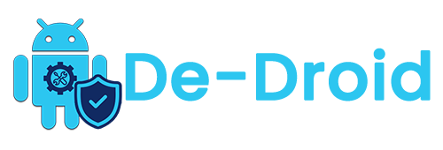

<p align="center">
  <br/>
  <sub>Logo designed by <a href="https://github.com/sushant-yog">Sushant Bhattarai</a></sub>
</p>
<p align="center">
  <strong>Debloat Android. De-bloat. Destroy bloatware.</strong><br/>
  A local-first desktop app to safely remove Android bloatware on non-rooted devices.<br/>
  <br/>
</p>

# De-Droid

De-Droid combines local ADB execution with safety intelligence to help you remove unnecessary apps with confidence.

- Local ADB actions for uninstall, disable, enable, and restore.
- Safety labels (`RECOMMENDED`, `ADVANCED`, `EXPERT`, `UNSAFE`) with confidence signals.
- Smart filtering for system/user, bloatware, state, and removal level.
- Backup snapshots, history tracking, and before/after comparisons.
- Permission and background control insights per package.
- Download Opensource application from fdroid.
- Optional ML-assisted package safety scoring via FastAPI.

## Architecture

De-Droid follows a local-first architecture:

- **Desktop app (`desktop-app/`)**: Electron + React + TypeScript UI and local command execution.
- **Model API (`model-api/`)**: optional FastAPI service for advanced safety predictions.
- **Local data**: JSON + SQLite for package metadata, backups, history, telemetry, and settings.

See `ARCHITECTURE.md` for full architecture details.

## Repository Structure

```text
de-droid/
  desktop-app/          # Electron + React + TypeScript app
  model-api/            # ML pipeline + FastAPI service
  LICENSE               # MIT license
  README.md
```

## Quick Start

### Requirements

- Node.js 20+
- npm
- Python 3.11+ (only for optional model API)

> Note: De-Droid supports bundled platform-tools for packaged releases, so end users do not need to install ADB manually.

### Run Desktop App

```bash
cd desktop-app
npm install
npm run dev
```

### Run Model API (Optional)

```bash
python -m venv model-api/env
source model-api/env/bin/activate
pip install -r model-api/requirements.txt
uvicorn main:app --app-dir model-api/model-api --host 0.0.0.0 --port 8000 --reload
```

### Train and Export Predictions (Optional)

```bash
python model-api/scripts/build_training_dataset.py
python model-api/scripts/train_safety_model.py --predictions-out-desktop desktop-app/src/data/safety_predictions.json
```

## Safety Labels

- `RECOMMENDED`: usually safe for most users.
- `ADVANCED`: needs review based on your use case.
- `EXPERT`: may affect features; remove only if you understand impact.
- `UNSAFE`: removal is blocked/restricted for safety.

## Model API Endpoints

- `GET /health`
- `POST /api/check-packages`
- `POST /api/check-single`
- `GET /api/stats`
- `GET /api/critical-packages`
- `GET /api/search/{query}`

## License

This project is licensed under the MIT License. See `LICENSE`.
