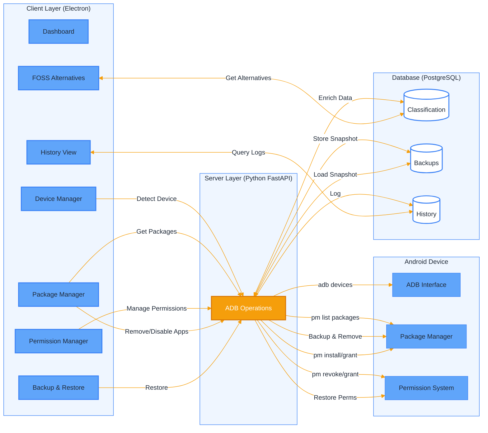
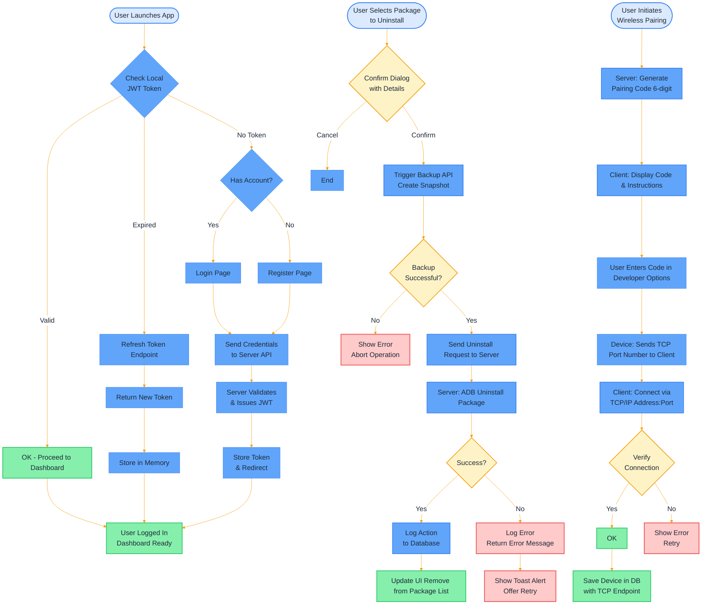

```mermaid
%%{init: {
  'theme':'base', 
  'themeVariables': {
    'primaryColor':'#60a5fa',
    'primaryTextColor':'#1f2937',
    'primaryBorderColor':'#3b82f6',
    'lineColor':'#F59E0B',
    'secondaryColor':'#F59E0B',
    'tertiaryColor':'#f3f4f6',
    'clusterBkg':'#eff6ff',
    'clusterBorder':'#3b82f6',
    'edgeLabelBackground':'#ffffff',
    'nodeTextColor':'#1f2937',
    'fontSize':'14px',
    'titleColor': '#1f2937'
}}}%%
flowchart LR
    subgraph Client ["Client Layer (Electron)"]
        Dashboard[Dashboard]
        DeviceMgr[Device Manager]
        PkgMgr[Package Manager]
        PermMgr[Permission Manager]
        BackupPanel[Backup & Restore]
        FOSSPanel[FOSS Alternatives]
        HistoryView[History View]
    end
    
    subgraph Server ["Server Layer (Python FastAPI)"]
        ADBOps[ADB Operations]
    end
    
    subgraph Device ["Android Device"]
        ADB[ADB Interface]
        PM[Package Manager]
        PermSys[Permission System]
    end
    
    subgraph DB ["Database (PostgreSQL)"]
        ClassifyDB[(Classification)]
        BackupDB[(Backups)]
        HistoryDB[(History)]
    end
    
    %% Main Flows
    DeviceMgr -->|Detect Device| ADBOps
    ADBOps -->|adb devices| ADB
    
    PkgMgr -->|Get Packages| ADBOps
    ADBOps -->|pm list packages| PM
    ADBOps <-->|Enrich Data| ClassifyDB
    
    PermMgr -->|Manage Permissions| ADBOps
    ADBOps -->|pm revoke/grant| PermSys
    ADBOps -->|Log| HistoryDB
    
    PkgMgr -->|Remove/Disable Apps| ADBOps
    ADBOps -->|Backup & Remove| PM
    ADBOps <-->|Store Snapshot| BackupDB
    
    BackupPanel -->|Restore| ADBOps
    ADBOps <-->|Load Snapshot| BackupDB
    ADBOps -->|pm install/grant| PM
    ADBOps -->|Restore Perms| PermSys
    
    FOSSPanel <-->|Get Alternatives| ClassifyDB
    HistoryView <-->|Query Logs| HistoryDB
    
    classDef primaryStyle fill:#60a5fa,stroke:#3b82f6,stroke-width:2px,color:#1f2937
    classDef secondaryStyle fill:#F59E0B,stroke:#d97706,stroke-width:2px,color:#fff
    classDef dbStyle fill:#ffffff,stroke:#3b82f6,stroke-width:2px,color:#1f2937
    
    class Dashboard,DeviceMgr,PkgMgr,PermMgr,BackupPanel,FOSSPanel,HistoryView primaryStyle
    ```
    class ADBOps secondaryStyle
    class ClassifyDB,BackupDB,HistoryDB dbStyle

```

## Flow Chart

```mermaid
%%{init: {'theme':'base', 'themeVariables': {
  'primaryColor':'#60a5fa',
  'primaryTextColor':'#1f2937',
  'primaryBorderColor':'#3b82f6',
  'lineColor':'#F59E0B',
  'secondaryColor':'#F59E0B',
  'tertiaryColor':'#dbeafe',
  'clusterBkg':'#eff6ff',
  'clusterBorder':'#3b82f6',
  'edgeLabelBackground':'#ffffff',
  'nodeTextColor':'#1f2937',
  'fontSize':'20px',
  'noteBkgColor':'#fff3cd',
  'noteBorderColor':'#F59E0B'
}}}%%
graph TD
    %% User Authentication Flow
    Start([User Launches App]) --> CheckToken{Check Local<br/>JWT Token}
    
    CheckToken -->|Valid| OK[OK - Proceed to Dashboard]
    CheckToken -->|Expired| Refresh[Refresh Token Endpoint]
    CheckToken -->|No Token| HasAccount{Has Account?}
    
    Refresh --> NewToken[Return New Token]
    NewToken --> StoreMemory[Store in Memory]
    StoreMemory --> Dashboard[User Logged In<br/>Dashboard Ready]
    
    HasAccount -->|Yes| Login[Login Page]
    HasAccount -->|No| Register[Register Page]
    
    Login --> SendCreds[Send Credentials<br/>to Server API]
    Register --> SendCreds
    
    SendCreds --> Validate[Server Validates<br/>& Issues JWT]
    Validate --> StoreToken[Store Token<br/>& Redirect]
    StoreToken --> Dashboard
    
    OK --> Dashboard
    
    %% Package Uninstall Workflow
    PStart([User Selects Package<br/>to Uninstall]) --> PConfirm{Confirm Dialog<br/>with Details}
    
    PConfirm -->|Cancel| PEnd[End]
    PConfirm -->|Confirm| PBackup[Trigger Backup API<br/>Create Snapshot]
    
    PBackup --> PBackupCheck{Backup<br/>Successful?}
    PBackupCheck -->|No| PError1[Show Error<br/>Abort Operation]
    PBackupCheck -->|Yes| PSend[Send Uninstall Request to Server ]
    
    PSend --> PAdb[Server: ADB Uninstall Package]
    PAdb --> PSuccess{Success?}
    
    PSuccess -->|Yes| PLog[Log Action<br/>to Database]
    PSuccess -->|No| PError2[Log Error<br/>Return Error Message]
    
    PLog --> PUpdate[Update UI Remove from Package List]
    PError2 --> PAlert[Show Toast Alert<br/>Offer Retry]
    
    %% Wireless Pairing Flow
    WStart([User Initiates<br/>Wireless Pairing]) --> WGen[Server: Generate<br/>Pairing Code 6-digit]
    WGen --> WDisplay[Client: Display Code & Instructions]
    WDisplay --> WEnter[User Enters Code in Developer Options]
    WEnter --> WSend[Device: Sends TCP Port Number to Client]
    WSend --> WConnect[Client: Connect via<br/>TCP/IP Address:Port]
    WConnect --> WVerify{Verify<br/>Connection}
    
    WVerify -->|Yes| WOK[OK]
    WVerify -->|No| WError[Show Error<br/>Retry]
    
    WOK --> WSave[Save Device in DB<br/>with TCP Endpoint]
    
    classDef startStyle fill:#dbeafe,stroke:#3b82f6,stroke-width:2px,color:#1f2937
    classDef successStyle fill:#86efac,stroke:#22c55e,stroke-width:2px,color:#1f2937
    classDef errorStyle fill:#fecaca,stroke:#ef4444,stroke-width:2px,color:#1f2937
    classDef processStyle fill:#60a5fa,stroke:#3b82f6,stroke-width:2px,color:#1f2937
    classDef warningStyle fill:#fef3c7,stroke:#F59E0B,stroke-width:2px,color:#1f2937
    
    class Start,PStart,WStart startStyle
    class Dashboard,OK,PUpdate,WSave,WOK successStyle
    class PError1,PError2,PAlert,WError errorStyle
    class PBackup,PSend,PAdb,PLog,WGen,WDisplay,WConnect processStyle
    class PConfirm,PBackupCheck,PSuccess,WVerify warningStyle
```

