```mermaid
%%{init: {
  'theme':'base', 
  'themeVariables': {
    'primaryColor':'#60a5fa',
    'primaryTextColor':'#1f2937',
    'primaryBorderColor':'#3b82f6',
    'lineColor':'#F59E0B',
    'secondaryColor':'#F59E0B',
    'tertiaryColor':'#f3f4f6',
    'clusterBkg':'#eff6ff',
    'clusterBorder':'#3b82f6',
    'edgeLabelBackground':'#ffffff',
    'nodeTextColor':'#1f2937',
    'fontSize':'14px',
    'titleColor': '#1f2937'
}}}%%
flowchart LR
    %% New Architecture: Electron handles ADB locally, FastAPI handles intelligence only
    
    subgraph Client ["Client Layer (Electron + Local ADB Engine)"]
        Dashboard[Dashboard]
        DeviceMgr[Device Manager]
        PkgMgr[Package Manager]
        BackupPanel[Backup & Restore]
        WirelessPair[Wireless Pairing]
        HistoryView[History View]
        LocalADB[Local ADB Execution<br/>Node.js child_process]
    end
    
    subgraph Server ["Intelligence Layer (Python FastAPI)"]
        Auth[Authentication & JWT]
        SafetyCheck[Package Safety Checker<br/>Red/Yellow/Green]
        EventLog[Event Logging Service]
    end
    
    subgraph Device ["Android Device (USB/Wireless)"]
        ADB[ADB Interface]
        PM[Package Manager]
    end
    
    subgraph DB ["Database (SQLite/PostgreSQL)"]
        UserDB[(Users & Sessions)]
        SafetyDB[(Package Safety DB)]
        HistoryDB[(Action History)]
        BackupDB[(Backup Snapshots)]
    end
    
    %% Core Architecture Flows
    %% All ADB operations execute locally in Electron
    DeviceMgr -->|Direct Local| LocalADB
    LocalADB -->|adb devices| ADB
    
    PkgMgr -->|Direct Local| LocalADB
    LocalADB -->|pm list packages| PM
    PkgMgr -->|Request Safety Data| SafetyCheck
    SafetyCheck <-->|Query Ratings| SafetyDB
    
    PkgMgr -->|Uninstall/Disable| LocalADB
    LocalADB -->|pm uninstall/disable| PM
    PkgMgr -->|Log Action<br/>(Non-blocking)| EventLog
    EventLog -->|Store| HistoryDB
    
    BackupPanel -->|Create/Restore| LocalADB
    LocalADB -->|pm install-existing| PM
    BackupPanel <-->|Store/Load Snapshots| BackupDB
    
    WirelessPair -->|Pair Device| LocalADB
    LocalADB -->|adb pair/connect| ADB
    
    HistoryView <-->|Query Logs| HistoryDB
    Dashboard -->|Authenticate| Auth
    Auth <-->|Manage Sessions| UserDB
    
    classDef primaryStyle fill:#60a5fa,stroke:#3b82f6,stroke-width:2px,color:#1f2937
    classDef adbStyle fill:#F59E0B,stroke:#d97706,stroke-width:2px,color:#fff
    classDef serverStyle fill:#a855f7,stroke:#9333ea,stroke-width:2px,color:#fff
    classDef dbStyle fill:#ffffff,stroke:#3b82f6,stroke-width:2px,color:#1f2937
    
    class Dashboard,DeviceMgr,PkgMgr,BackupPanel,WirelessPair,HistoryView primaryStyle
    class LocalADB adbStyle
    class Auth,SafetyCheck,EventLog serverStyle
    class UserDB,SafetyDB,HistoryDB,BackupDB dbStyle
```


## Flow Chart

```mermaid
%%{init: {'theme':'base', 'themeVariables': {
  'primaryColor':'#60a5fa',
  'primaryTextColor':'#1f2937',
  'primaryBorderColor':'#3b82f6',
  'lineColor':'#F59E0B',
  'secondaryColor':'#F59E0B',
  'tertiaryColor':'#dbeafe',
  'clusterBkg':'#eff6ff',
  'clusterBorder':'#3b82f6',
  'edgeLabelBackground':'#ffffff',
  'nodeTextColor':'#1f2937',
  'fontSize':'16px',
  'noteBkgColor':'#fff3cd',
  'noteBorderColor':'#F59E0B'
}}}%%
graph TD
    %% ============================================================
    %% AUTHENTICATION FLOW
    %% FastAPI server handles JWT authentication and user management
    %% ============================================================
    Start([User Launches App]) --> CheckToken{Check Local<br/>JWT Token}
    
    CheckToken -->|Valid & Not Expired| AuthOK[Authentication OK]
    CheckToken -->|Expired| Refresh[Request Token Refresh<br/>FastAPI Server]
    CheckToken -->|No Token| HasAccount{Has Account?}
    
    Refresh --> RefreshCheck{Refresh<br/>Successful?}
    RefreshCheck -->|Yes| NewToken[Receive New JWT Token]
    RefreshCheck -->|No| HasAccount
    NewToken --> StoreToken1[Store Token in Memory]
    StoreToken1 --> AuthOK
    
    HasAccount -->|Yes| LoginPage[Show Login Page]
    HasAccount -->|No| RegisterPage[Show Register Page]
    
    LoginPage --> SendLoginCreds[Send Credentials to<br/>FastAPI Server]
    RegisterPage --> SendRegisterCreds[Send Registration Data to<br/>FastAPI Server]
    
    SendLoginCreds --> ValidateLogin[Server Validates &<br/>Issues JWT Token]
    SendRegisterCreds --> ValidateRegister[Server Creates User &<br/>Issues JWT Token]
    
    ValidateLogin --> LoginCheck{Login<br/>Successful?}
    ValidateRegister --> RegisterCheck{Registration<br/>Successful?}
    
    LoginCheck -->|Yes| StoreToken2[Store JWT Token]
    LoginCheck -->|No| LoginError[Show Login Error]
    LoginError --> LoginEnd([End])
    
    RegisterCheck -->|Yes| StoreToken3[Store JWT Token]
    RegisterCheck -->|No| RegisterError[Show Registration Error]
    RegisterError --> RegisterEnd([End])
    
    StoreToken2 --> AuthOK
    StoreToken3 --> AuthOK
    AuthOK --> Dashboard[Dashboard Ready<br/>User Logged In]
    Dashboard --> DashEnd([End])
    
    %% ============================================================
    %% DEVICE DETECTION FLOW
    %% Electron executes ADB commands locally via Node.js
    %% ============================================================
    DevStart([User Opens Device Manager]) --> StartADB[Electron: Start Local<br/>ADB Server]
    StartADB --> ScanDevices[Electron: Execute<br/>adb devices -l<br/>Locally]
    ScanDevices --> DeviceFound{Device<br/>Found?}
    
    DeviceFound -->|Yes| GetDeviceInfo[Electron: Get Device Info<br/>adb shell getprop<br/>Model, Brand, Android Version]
    DeviceFound -->|No| ShowNoDevice[Show No Device Message<br/>Prompt USB Debug/Wireless]
    ShowNoDevice --> DevRetry{User<br/>Retries?}
    DevRetry -->|Yes| ScanDevices
    DevRetry -->|No| DevEndNo([End])
    
    GetDeviceInfo --> DisplayDevice[Display Device Info<br/>in UI]
    DisplayDevice --> DevEndYes([End])
    
    %% ============================================================
    %% PACKAGE UNINSTALL FLOW WITH SAFETY CHECKS
    %% Electron handles ADB, FastAPI provides safety intelligence
    %% ============================================================
    PkgStart([User Selects Package<br/>to Uninstall]) --> FetchSafety[Check Package Safety<br/>Request from FastAPI<br/>Safety Database]
    
    FetchSafety --> SafetyResult{Safety<br/>Rating?}
    
    SafetyResult -->|Red - Critical| BlockUninstall[Block Action<br/>Show Critical Warning:<br/>Will Brick Phone]
    SafetyResult -->|Yellow - Caution| WarnUser[Show Warning Dialog<br/>Proceed with Caution]
    SafetyResult -->|Green - Safe| ConfirmDialog[Show Confirmation<br/>Dialog]
    SafetyResult -->|Unknown - Offline| OfflineWarn[Show Offline Warning<br/>Proceed with Caution]
    
    BlockUninstall --> BlockEnd([End])
    
    WarnUser --> UserConfirm1{User<br/>Confirms?}
    UserConfirm1 -->|No| CancelEnd1([End])
    UserConfirm1 -->|Yes| CreateBackup
    
    OfflineWarn --> UserConfirm2{User<br/>Confirms?}
    UserConfirm2 -->|No| CancelEnd2([End])
    UserConfirm2 -->|Yes| CreateBackup
    
    ConfirmDialog --> UserConfirm3{User<br/>Confirms?}
    UserConfirm3 -->|No| CancelEnd3([End])
    UserConfirm3 -->|Yes| CreateBackup
    
    CreateBackup[Electron: Create Backup<br/>Store Package State<br/>to Local Database]
    CreateBackup --> BackupOK{Backup<br/>Created?}
    
    BackupOK -->|No| BackupError[Show Backup Error<br/>Abort Uninstall]
    BackupError --> BackupErrorEnd([End])
    
    BackupOK -->|Yes| ExecuteUninstall[Electron: Execute Locally<br/>adb shell pm uninstall<br/>-k --user 0 package]
    
    ExecuteUninstall --> UninstallSuccess{Uninstall<br/>Successful?}
    
    UninstallSuccess -->|Yes| LogAction[Send Log Event to<br/>FastAPI Server<br/>Non-blocking]
    UninstallSuccess -->|No| UninstallError[Show Error Message<br/>Offer Retry Option]
    
    LogAction --> LogComplete[FastAPI: Store Action<br/>in History Database]
    LogComplete --> UpdateUI[Update Package List UI<br/>Remove Package]
    UpdateUI --> UninstallEnd([End])
    
    UninstallError --> RetryUninstall{User<br/>Retries?}
    RetryUninstall -->|Yes| ExecuteUninstall
    RetryUninstall -->|No| UninstallErrorEnd([End])
    
    %% ============================================================
    %% BACKUP AND RESTORE FLOW
    %% All ADB operations local, backup data stored in database
    %% ============================================================
    BackupStart([User Initiates<br/>Backup/Restore]) --> BackupAction{Action<br/>Type?}
    
    BackupAction -->|Create Backup| GetAllPackages[Electron: Get Package List<br/>adb shell pm list packages]
    BackupAction -->|Restore Backup| SelectBackup[User Selects<br/>Backup Snapshot]
    
    GetAllPackages --> SaveSnapshot[Save Snapshot to<br/>Local Database<br/>with Metadata]
    SaveSnapshot --> BackupCompleteMsg[Show Backup Complete<br/>Message]
    BackupCompleteMsg --> BackupCompleteEnd([End])
    
    SelectBackup --> LoadSnapshot[Load Snapshot from<br/>Local Database]
    LoadSnapshot --> RestorePackages[Electron: Restore Packages<br/>adb shell cmd package<br/>install-existing]
    RestorePackages --> RestoreResult{Restore<br/>Successful?}
    
    RestoreResult -->|Yes| RestoreLog[Send Restore Event to<br/>FastAPI Server]
    RestoreResult -->|No| RestoreError[Show Restore Error<br/>with Details]
    
    RestoreLog --> RestoreComplete[Show Restore Complete<br/>Message]
    RestoreComplete --> RestoreEnd([End])
    RestoreError --> RestoreErrorEnd([End])
    
    %% ============================================================
    %% WIRELESS PAIRING FLOW
    %% Electron handles ADB pairing, no server involvement
    %% ============================================================
    WirelessStart([User Initiates<br/>Wireless Pairing]) --> ShowInstructions[Show Instructions:<br/>Enable Wireless Debugging<br/>in Developer Options]
    
    ShowInstructions --> GetPairingCode[User Enters Pairing<br/>Code & Port from Device]
    GetPairingCode --> CodeEntered{Code &<br/>Port Entered?}
    
    CodeEntered -->|No| WirelessCancelEnd([End])
    CodeEntered -->|Yes| ExecutePair[Electron: Execute<br/>adb pair IP:PORT CODE<br/>Locally]
    
    ExecutePair --> PairSuccess{Pairing<br/>Successful?}
    
    PairSuccess -->|No| PairError[Show Pairing Error<br/>Verify Code/IP]
    PairError --> RetryPair{User<br/>Retries?}
    RetryPair -->|Yes| GetPairingCode
    RetryPair -->|No| PairErrorEnd([End])
    
    PairSuccess -->|Yes| ConnectWireless[Electron: Connect<br/>adb connect IP:PORT<br/>Locally]
    ConnectWireless --> ConnectSuccess{Connected?}
    
    ConnectSuccess -->|No| ConnectError[Show Connection Error]
    ConnectError --> ConnectErrorEnd([End])
    
    ConnectSuccess -->|Yes| SaveWirelessDevice[Save Device Connection<br/>for Auto-Reconnect]
    SaveWirelessDevice --> WirelessSuccess[Show Success Message<br/>Device Connected]
    WirelessSuccess --> WirelessEnd([End])
    
    %% ============================================================
    %% STYLING DEFINITIONS
    %% ============================================================
    classDef startStyle fill:#dbeafe,stroke:#3b82f6,stroke-width:3px,color:#1f2937,font-weight:bold
    classDef endStyle fill:#d1fae5,stroke:#10b981,stroke-width:3px,color:#1f2937,font-weight:bold
    classDef errorStyle fill:#fecaca,stroke:#ef4444,stroke-width:2px,color:#1f2937
    classDef processStyle fill:#60a5fa,stroke:#3b82f6,stroke-width:2px,color:#1f2937
    classDef electronStyle fill:#FCD34D,stroke:#F59E0B,stroke-width:2px,color:#1f2937
    classDef serverStyle fill:#c084fc,stroke:#a855f7,stroke-width:2px,color:#1f2937
    classDef warningStyle fill:#fef3c7,stroke:#F59E0B,stroke-width:2px,color:#1f2937
    classDef successStyle fill:#86efac,stroke:#22c55e,stroke-width:2px,color:#1f2937
    
    class Start,DevStart,PkgStart,BackupStart,WirelessStart startStyle
    class DashEnd,LoginEnd,RegisterEnd,DevEndNo,DevEndYes,BlockEnd,CancelEnd1,CancelEnd2,CancelEnd3,BackupErrorEnd,UninstallEnd,UninstallErrorEnd,BackupCompleteEnd,RestoreEnd,RestoreErrorEnd,WirelessCancelEnd,PairErrorEnd,ConnectErrorEnd,WirelessEnd endStyle
    class LoginError,RegisterError,ShowNoDevice,UninstallError,BackupError,RestoreError,PairError,ConnectError errorStyle
    class StartADB,ScanDevices,GetDeviceInfo,ExecuteUninstall,GetAllPackages,RestorePackages,ExecutePair,ConnectWireless electronStyle
    class SendLoginCreds,SendRegisterCreds,ValidateLogin,ValidateRegister,Refresh,FetchSafety,LogAction,LogComplete,RestoreLog serverStyle
    class AuthOK,Dashboard,DisplayDevice,UpdateUI,BackupCompleteMsg,RestoreComplete,SaveWirelessDevice,WirelessSuccess successStyle
```




