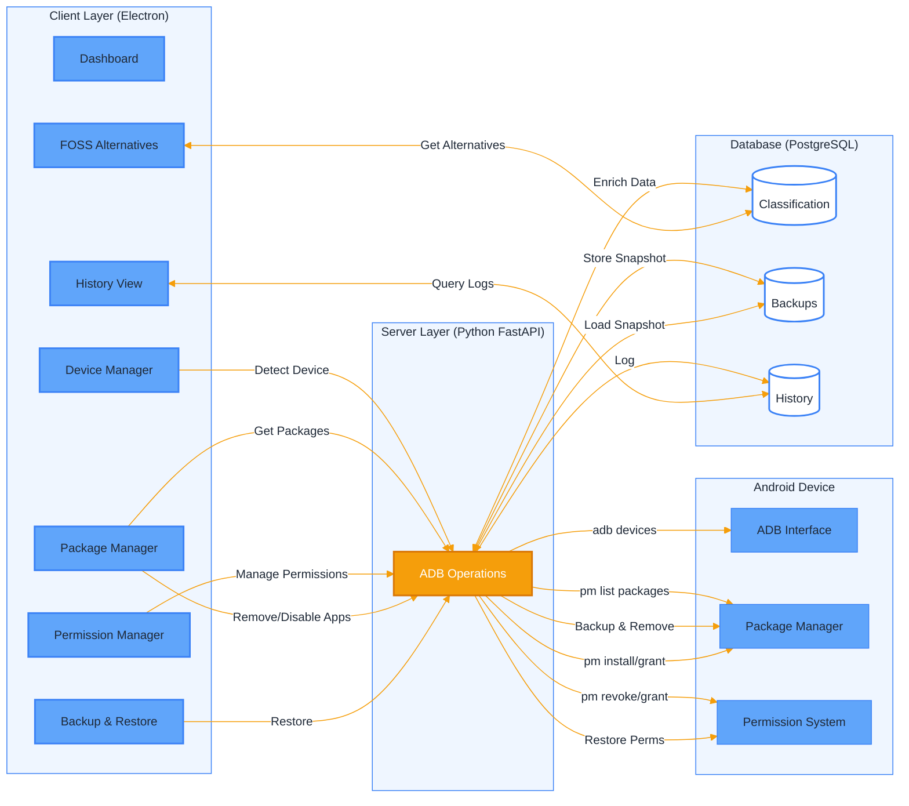

# System Architecture Diagram

```mermaid
%%{init: {
  'theme':'base',
  'themeVariables': {
    'primaryColor':'#60a5fa',
    'primaryTextColor':'#1f2937',
    'primaryBorderColor':'#3b82f6',
    'lineColor':'#F59E0B',
    'secondaryColor':'#F59E0B',
    'tertiaryColor':'#f3f4f6',
    'clusterBkg':'#eff6ff',
    'clusterBorder':'#3b82f6',
    'edgeLabelBackground':'#ffffff',
    'nodeTextColor':'#1f2937',
    'fontSize':'14px',
    'titleColor': '#1f2937'
}}}%%
flowchart LR
    subgraph Client ["Client Layer (Electron)"]
        Dashboard[Dashboard]
        DeviceMgr[Device Manager]
        PkgMgr[Package Manager]
        PermMgr[Permission Manager]
        BackupPanel[Backup & Restore]
        FOSSPanel[FOSS Alternatives]
        HistoryView[History View]
    end

    subgraph Server ["Server Layer (Python FastAPI)"]
        ADBOps[ADB Operations]
    end

    subgraph Device ["Android Device"]
        ADB[ADB Interface]
        PM[Package Manager]
        PermSys[Permission System]
    end

    subgraph DB ["Database (PostgreSQL)"]
        ClassifyDB[(Classification)]
        BackupDB[(Backups)]
        HistoryDB[(History)]
    end

    %% Main Flows
    DeviceMgr -->|Detect Device| ADBOps
    ADBOps -->|adb devices| ADB

    PkgMgr -->|Get Packages| ADBOps
    ADBOps -->|pm list packages| PM
    ADBOps <-->|Enrich Data| ClassifyDB

    PermMgr -->|Manage Permissions| ADBOps
    ADBOps -->|pm revoke/grant| PermSys
    ADBOps -->|Log| HistoryDB

    PkgMgr -->|Remove/Disable Apps| ADBOps
    ADBOps -->|Backup & Remove| PM
    ADBOps <-->|Store Snapshot| BackupDB

    BackupPanel -->|Restore| ADBOps
    ADBOps <-->|Load Snapshot| BackupDB
    ADBOps -->|pm install/grant| PM
    ADBOps -->|Restore Perms| PermSys

    FOSSPanel <-->|Get Alternatives| ClassifyDB
    HistoryView <-->|Query Logs| HistoryDB

    classDef primaryStyle fill:#60a5fa,stroke:#3b82f6,stroke-width:2px,color:#1f2937
    classDef secondaryStyle fill:#F59E0B,stroke:#d97706,stroke-width:2px,color:#fff
    classDef dbStyle fill:#ffffff,stroke:#3b82f6,stroke-width:2px,color:#1f2937

    class Dashboard,DeviceMgr,PkgMgr,PermMgr,BackupPanel,FOSSPanel,HistoryView primaryStyle
    class ADBOps secondaryStyle
    class ClassifyDB,BackupDB,HistoryDB dbStyle
```
