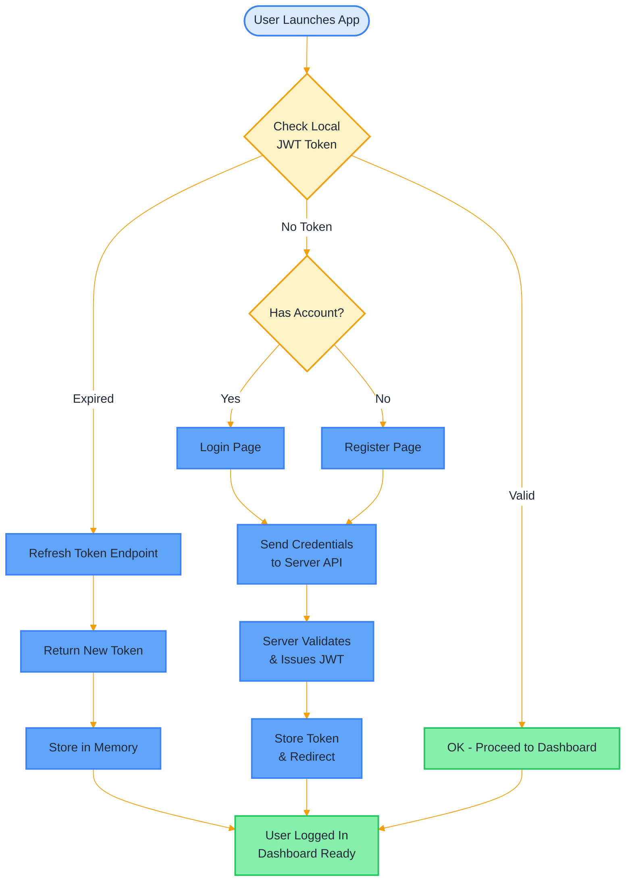

# User Authentication Flow

```mermaid
%%{init: {'theme':'base', 'themeVariables': {
  'primaryColor':'#60a5fa',
  'primaryTextColor':'#1f2937',
  'primaryBorderColor':'#3b82f6',
  'lineColor':'#F59E0B',
  'secondaryColor':'#F59E0B',
  'tertiaryColor':'#dbeafe',
  'clusterBkg':'#eff6ff',
  'clusterBorder':'#3b82f6',
  'edgeLabelBackground':'#ffffff',
  'nodeTextColor':'#1f2937',
  'fontSize':'16px'
}}}%%
graph TD
    Start([User Launches App]) --> CheckToken{Check Local<br/>JWT Token}

    CheckToken -->|Valid| OK[OK - Proceed to Dashboard]
    CheckToken -->|Expired| Refresh[Refresh Token Endpoint]
    CheckToken -->|No Token| HasAccount{Has Account?}

    Refresh --> NewToken[Return New Token]
    NewToken --> StoreMemory[Store in Memory]
    StoreMemory --> Dashboard[User Logged In<br/>Dashboard Ready]

    HasAccount -->|Yes| Login[Login Page]
    HasAccount -->|No| Register[Register Page]

    Login --> SendCreds[Send Credentials<br/>to Server API]
    Register --> SendCreds

    SendCreds --> Validate[Server Validates<br/>& Issues JWT]
    Validate --> StoreToken[Store Token<br/>& Redirect]
    StoreToken --> Dashboard

    OK --> Dashboard

    classDef startStyle fill:#dbeafe,stroke:#3b82f6,stroke-width:2px,color:#1f2937
    classDef successStyle fill:#86efac,stroke:#22c55e,stroke-width:2px,color:#1f2937
    classDef processStyle fill:#60a5fa,stroke:#3b82f6,stroke-width:2px,color:#1f2937
    classDef decisionStyle fill:#fef3c7,stroke:#F59E0B,stroke-width:2px,color:#1f2937

    class Start startStyle
    class Dashboard,OK successStyle
    class Refresh,NewToken,StoreMemory,Login,Register,SendCreds,Validate,StoreToken processStyle
    class CheckToken,HasAccount decisionStyle
```
