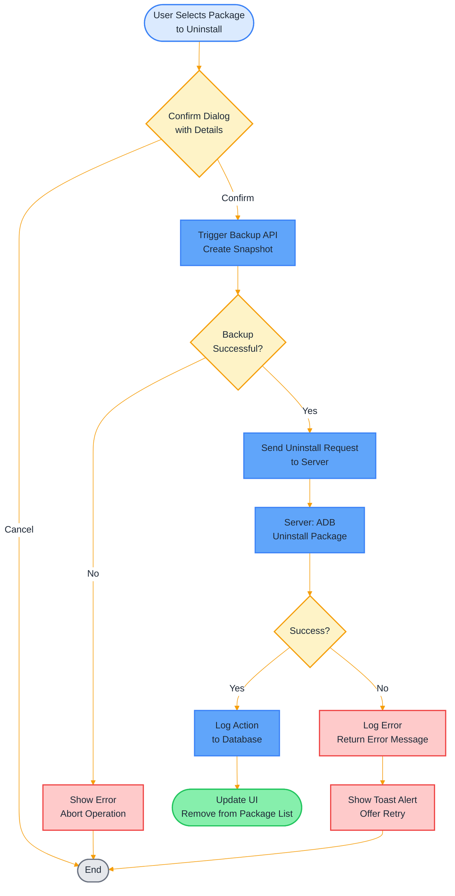

# Package Uninstall Workflow

```mermaid
%%{init: {'theme':'base', 'themeVariables': {
  'primaryColor':'#60a5fa',
  'primaryTextColor':'#1f2937',
  'primaryBorderColor':'#3b82f6',
  'lineColor':'#F59E0B',
  'secondaryColor':'#F59E0B',
  'tertiaryColor':'#dbeafe',
  'clusterBkg':'#eff6ff',
  'clusterBorder':'#3b82f6',
  'edgeLabelBackground':'#ffffff',
  'nodeTextColor':'#1f2937',
  'fontSize':'16px'
}}}%%
graph TD
    PStart([User Selects Package<br/>to Uninstall]) --> PConfirm{Confirm Dialog<br/>with Details}

    PConfirm -->|Cancel| PEnd([End])
    PConfirm -->|Confirm| PBackup[Trigger Backup API<br/>Create Snapshot]

    PBackup --> PBackupCheck{Backup<br/>Successful?}
    PBackupCheck -->|No| PError1[Show Error<br/>Abort Operation]
    PBackupCheck -->|Yes| PSend[Send Uninstall Request<br/>to Server]

    PSend --> PAdb[Server: ADB<br/>Uninstall Package]
    PAdb --> PSuccess{Success?}

    PSuccess -->|Yes| PLog[Log Action<br/>to Database]
    PSuccess -->|No| PError2[Log Error<br/>Return Error Message]

    PLog --> PUpdate([Update UI<br/>Remove from Package List])
    PError2 --> PAlert[Show Toast Alert<br/>Offer Retry]
    PError1 --> PEnd
    PAlert --> PEnd

    classDef startStyle fill:#dbeafe,stroke:#3b82f6,stroke-width:2px,color:#1f2937
    classDef successStyle fill:#86efac,stroke:#22c55e,stroke-width:2px,color:#1f2937
    classDef errorStyle fill:#fecaca,stroke:#ef4444,stroke-width:2px,color:#1f2937
    classDef processStyle fill:#60a5fa,stroke:#3b82f6,stroke-width:2px,color:#1f2937
    classDef decisionStyle fill:#fef3c7,stroke:#F59E0B,stroke-width:2px,color:#1f2937
    classDef endStyle fill:#e5e7eb,stroke:#6b7280,stroke-width:2px,color:#1f2937

    class PStart startStyle
    class PUpdate successStyle
    class PError1,PError2,PAlert errorStyle
    class PBackup,PSend,PAdb,PLog processStyle
    class PConfirm,PBackupCheck,PSuccess decisionStyle
    class PEnd endStyle
```
