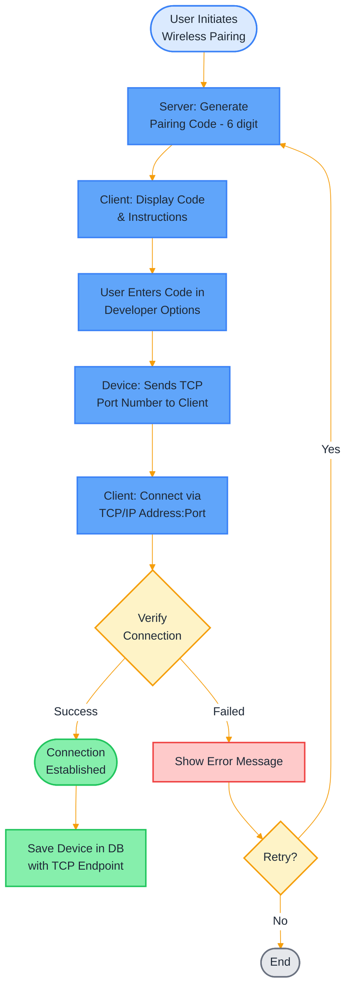

# Wireless Pairing Flow

```mermaid
%%{init: {'theme':'base', 'themeVariables': {
  'primaryColor':'#60a5fa',
  'primaryTextColor':'#1f2937',
  'primaryBorderColor':'#3b82f6',
  'lineColor':'#F59E0B',
  'secondaryColor':'#F59E0B',
  'tertiaryColor':'#dbeafe',
  'clusterBkg':'#eff6ff',
  'clusterBorder':'#3b82f6',
  'edgeLabelBackground':'#ffffff',
  'nodeTextColor':'#1f2937',
  'fontSize':'16px'
}}}%%
graph TD
    WStart([User Initiates<br/>Wireless Pairing]) --> WGen[Server: Generate<br/>Pairing Code - 6 digit]

    WGen --> WDisplay[Client: Display Code<br/>& Instructions]

    WDisplay --> WEnter[User Enters Code in<br/>Developer Options]

    WEnter --> WSend[Device: Sends TCP<br/>Port Number to Client]

    WSend --> WConnect[Client: Connect via<br/>TCP/IP Address:Port]

    WConnect --> WVerify{Verify<br/>Connection}

    WVerify -->|Success| WOK([Connection<br/>Established])
    WVerify -->|Failed| WError[Show Error Message]

    WOK --> WSave[Save Device in DB<br/>with TCP Endpoint]

    WError --> WRetry{Retry?}
    WRetry -->|Yes| WGen
    WRetry -->|No| WEnd([End])

    classDef startStyle fill:#dbeafe,stroke:#3b82f6,stroke-width:2px,color:#1f2937
    classDef successStyle fill:#86efac,stroke:#22c55e,stroke-width:2px,color:#1f2937
    classDef errorStyle fill:#fecaca,stroke:#ef4444,stroke-width:2px,color:#1f2937
    classDef processStyle fill:#60a5fa,stroke:#3b82f6,stroke-width:2px,color:#1f2937
    classDef decisionStyle fill:#fef3c7,stroke:#F59E0B,stroke-width:2px,color:#1f2937
    classDef endStyle fill:#e5e7eb,stroke:#6b7280,stroke-width:2px,color:#1f2937

    class WStart startStyle
    class WOK,WSave successStyle
    class WError errorStyle
    class WGen,WDisplay,WEnter,WSend,WConnect processStyle
    class WVerify,WRetry decisionStyle
    class WEnd endStyle
```
