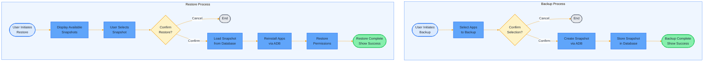

# Backup & Restore Flow

```mermaid
%%{init: {'theme':'base', 'themeVariables': {
  'primaryColor':'#60a5fa',
  'primaryTextColor':'#1f2937',
  'primaryBorderColor':'#3b82f6',
  'lineColor':'#F59E0B',
  'secondaryColor':'#F59E0B',
  'tertiaryColor':'#dbeafe',
  'clusterBkg':'#eff6ff',
  'clusterBorder':'#3b82f6',
  'edgeLabelBackground':'#ffffff',
  'nodeTextColor':'#1f2937',
  'fontSize':'16px'
}}}%%
graph TD
    subgraph Backup ["Backup Process"]
        BStart([User Initiates<br/>Backup]) --> BSelect[Select Apps<br/>to Backup]
        BSelect --> BConfirm{Confirm<br/>Selection?}
        BConfirm -->|Cancel| BEnd([End])
        BConfirm -->|Confirm| BCreate[Create Snapshot<br/>via ADB]
        BCreate --> BStore[Store Snapshot<br/>in Database]
        BStore --> BSuccess([Backup Complete<br/>Show Success])
    end

    subgraph Restore ["Restore Process"]
        RStart([User Initiates<br/>Restore]) --> RList[Display Available<br/>Snapshots]
        RList --> RSelect[User Selects<br/>Snapshot]
        RSelect --> RConfirm{Confirm<br/>Restore?}
        RConfirm -->|Cancel| REnd([End])
        RConfirm -->|Confirm| RLoad[Load Snapshot<br/>from Database]
        RLoad --> RInstall[Reinstall Apps<br/>via ADB]
        RInstall --> RPerms[Restore<br/>Permissions]
        RPerms --> RSuccess([Restore Complete<br/>Show Success])
    end

    classDef startStyle fill:#dbeafe,stroke:#3b82f6,stroke-width:2px,color:#1f2937
    classDef successStyle fill:#86efac,stroke:#22c55e,stroke-width:2px,color:#1f2937
    classDef processStyle fill:#60a5fa,stroke:#3b82f6,stroke-width:2px,color:#1f2937
    classDef decisionStyle fill:#fef3c7,stroke:#F59E0B,stroke-width:2px,color:#1f2937
    classDef endStyle fill:#e5e7eb,stroke:#6b7280,stroke-width:2px,color:#1f2937

    class BStart,RStart startStyle
    class BSuccess,RSuccess successStyle
    class BSelect,BCreate,BStore,RList,RSelect,RLoad,RInstall,RPerms processStyle
    class BConfirm,RConfirm decisionStyle
    class BEnd,REnd endStyle
```
